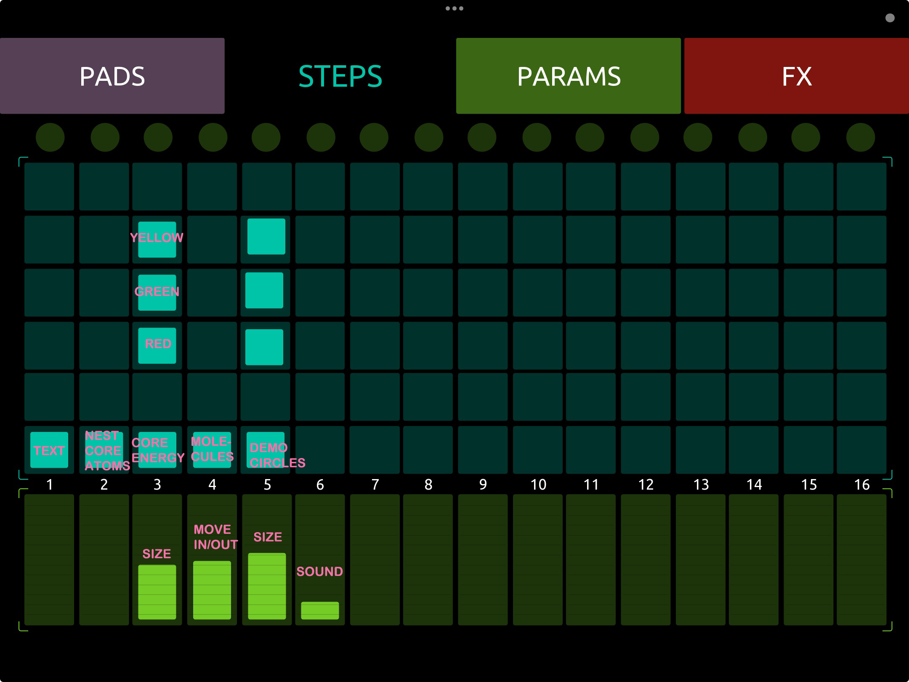

## LifeCycle : Interactive MIDO - Musical / Multimodal Digital Object

( p5.js + TouchOSC + OSC Bridge + Processing + MediaPipe)

**By Ursula Vallejo Janne**
Creative coder · Visual artist · Interaction design experiments

## Concept

**LifeCycle** is an audiovisual experiment connecting **TouchOSC (iPad/iPhone)** with **p5.js and Three.js web visuals** through OSC, using a custom **Node.js OSC bridge**.
Processing captures the microphone input, performs FFT analysis, and sends the frequency data to sculpt the visuals in real time based on **human voice interaction**.

The system simulates:

- Organic cells and micro-particle entities
- Molecular nests
- Atom clusters
- A voice-reactive energy core (Three.js)
- Curl-noise smoke spheres
- Color-shifting phases
- A small particle “bloom puff” burst

TouchOSC provides global control over the visual parameters, while audio analysis is mapped specifically to the energy core and cellular particle systems.

---

## Video


https://github.com/user-attachments/assets/a9f2e152-b1c1-4347-bdc7-e9f98488c4b7


---

## System Architecture

```
TouchOSC App (iPad/iPhone)
        ↓   OSC
Node.js Bridge (bridge.js)
        ↓   WebSockets
Browser
 ├─ p5.js / Three.js Visual Engine
 └─ MediaPipe Hands (Camera → Hand Landmarks)
```

- TouchOSC sends OSC messages (faders, toggles, buttons).
- `bridge.js` receives them and forwards to the browser via Socket.IO.
- Processing analyzes audio input (FFT: bass / mid / treble) and sends data via OSC.
- p5.js & Three.js combine OSC data, audio features, and hand landmarks to render and modulate the visuals.
- MediaPipe Hands runs in the browser, detects hand pose from the webcam, and outputs hand landmarks in real time.

---

<iframe style="border: 1px solid rgba(0, 0, 0, 0.1);" width="800" height="450" src="https://embed.figma.com/slides/RPa9w7NlXLYFx9Jgz5n0gZ/LifeCycle?node-id=1-36&embed-host=share" allowfullscreen></iframe>

---

# 🚀 How to Run the Project

## 1. Start Processing

Open:

```
life_cycle/osc/ProcessingOSC_Sound.pde
```

Click **Run** in Processing.

This captures microphone input, performs FFT, and starts sending OSC.

---

## 2. Start the OSC Bridge

Inside the `bridge` folder:

```bash
node bridge.js
```

Expected:

```
✅ Socket.IO listening on http://localhost:8081
```

Find your IP for TouchOSC:

```bash
ipconfig
```

Use your **IPv4 Address** as the TouchOSC HOST.

---

## 3. TouchOSC Setup

Preset used → **Beatmachine Mk2 / Steps layer**

### Controls

- **Toggle 1** → Show intro text

- **Toggle 2** → Molecular nest (background atoms)

- **Toggle 3** → Frame delay we used insted Three.js

  - Show Energy Core p5
  - Buttons A/B/C → color shifts
  - Fader → energy core size

- **Toggle 4** →

  - Show cells (micro-organisms)
  - Fader → open / close the cell cluster
  - Toggle 4 / 2 → enable hand control (open / close)
  - Rotation is always active

- **Toggle 5** →

  - Show Energy Core Three.js
  - Buttons A/B/C → color shifts
  - Fader → energy core size

- **Fader 6** → Control background music volume

- **Round button (top)** → Puff explosion (particle burst)

---

## 📱 TouchOSC Interface Screenshot



---

## 4. Start the Web Visualization

Open:

```
http://localhost:5500/index.html
```

⚠️ Must use **localhost**, not LAN IP.

---

# Audio System (p5.sound) Background Sound

- Browsers block autoplay → requires “Activate Sound” overlay
- Fader #6 in TouchOSC controls volume live

---

# Included Visual Modules

- Intro text animation
- CoreEnergy (Three.js smoke + deformation + tint)
- Cells (micro-organisms) - MediaPipe (Hand gestures)
- Molecular nest
- “Puff” particle explosion
- Full audio engine (p5 + Processing FFT)

---

# Audio → Visual Mapping

### Audio Input Breakdown

| Audio Band                    | Description              | Typical Values | Controls (Three.js)                         | Visual Result                                      |
| ----------------------------- | ------------------------ | -------------- | ------------------------------------------- | -------------------------------------------------- |
| **BASS** (low freqs)          | Plosives, deep tone      | 0.05–0.25      | `coreSpinSpeed`, part of `uDisplacementAmp` | Sphere rotates faster, feels heavier, soft pulsing |
| **MID** (mid freqs)           | Most human voice         | 0.10–0.40      | `uNoiseScale`, `uDisplacementAmp`           | Internal smoke gets more detailed and turbulent    |
| **TREBLE** (high freqs)       | “S”, “SH”, louder speech | 0.18–0.60      | **Halo sparks emission**                    | Yellow sparks in an outer ring                     |
| **ENERGY** (avg of all bands) | Overall loudness         | 0.10–0.40      | `uSmokeIntensity`                           | Core becomes more luminous, glowing, alive         |

---

## Signal Flow

```
Human voice → Microphone → Processing (FFT)
           → { bass, mid, tre } → OSC → Bridge.js
           → Browser (WebSocket) → ThreeCore.update()
           → Real-time visual transformation
```

---

## How It Feels in Practice

- **Normal speaking** →
  Inner smoke reacts: swirling, deforming, glowing.

- **High-frequency peaks (“sss”, louder voice)** →
  Yellow **halo sparks** appear.

- **Sharper or louder vocal peaks** →
  Core glows more, rotates faster, emits more sparks.

- **Ambient/room noise or music far from mic** →
  Almost no reaction.
  System is intentionally tuned for **close vocal interaction**.

---

## How the Audio Reactive System Works

Processing captures microphone audio → FFT → 3 frequency bands:

- **bass** → rotational energy + deformation weight
- **mid** → smoke complexity/turbulence
- **treble** → sparks emission
- **energy** (avg) → glow intensity

Three.js then uses these parameters to animate the sphere, producing a live, voice-reactive visual meant for interactive installations or performances.

---

# Hand Tracking & Gesture Control (MediaPipe)

MediaPipe Hands runs directly in the browser and provides real-time hand pose detection using the device’s webcam.

- It tracks 21 landmarks per hand (fingers, palm, joints).

- No OSC or external server is used for gesture detection.

- Hand data is processed locally and merged into the visual state.

In LifeCycle, MediaPipe is used specifically to control the Cells (micro-organisms) layer:

- Hand open / close → opens or contracts the cell cluster

- Gesture input can be enabled or disabled via TouchOSC

- Rotation remains constant and is not gesture-driven

## This allows physical, embodied interaction to coexist with audio-driven and UI-driven control, reinforcing the system’s multimodal instrument design.
